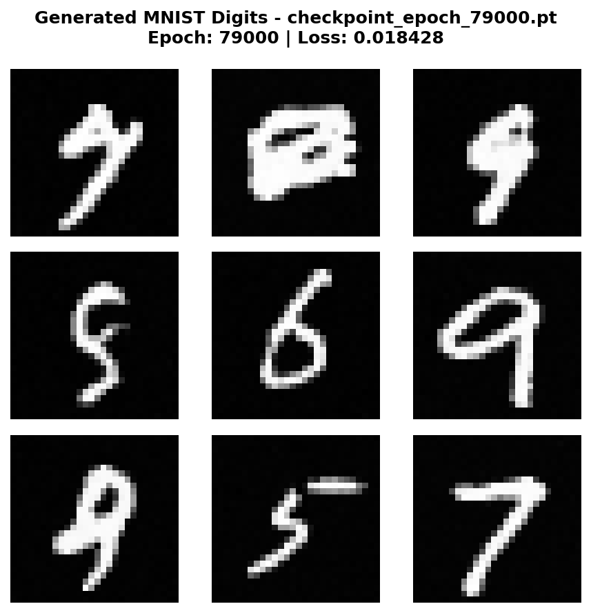
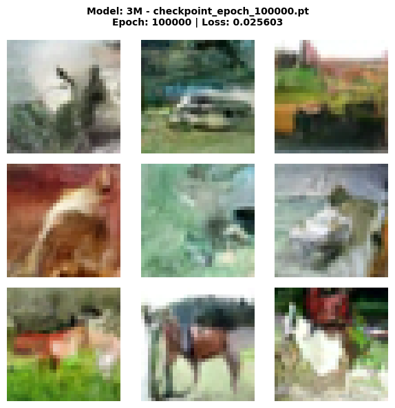

# DiffusionLab 🧠🧪

[](LICENSE)

A **from-scratch implementation** of Denoising Diffusion Probabilistic Models (DDPM)
that demonstrates the power of diffusion models for generative AI. This project
explores both the mathematical foundations and practical implementations of diffusion
models, progressing from toy 2D datasets to real-world image generation.

## 🎯 Project Highlights

- **Generic Training Pipeline**: One unified training function works across toy datasets (2D Moons), grayscale images (
  MNIST), and color images (CIFAR-10)
- **Multiple Architectures**: From simple MLPs to U-Net-style CNNs with time embeddings
- **Production Features**: Checkpoint management, model resumption, and automated visualization generation
- **Progressive Complexity**: Start simple (Moons) → intermediate (MNIST) → advanced (CIFAR-10)

## 🔬 What We've Built

The `diffusion_playground` package provides complete functionality for:

- **Forward Diffusion**: Gradually add noise to data according to a learned schedule
- **Reverse Diffusion**: Train models to denoise and generate new samples
- **Flexible Architectures**: Support for different model types (MLP, CNN/U-Net)
- **Visualization Tools**: Comprehensive plotting and analysis utilities
- **Training Infrastructure**: Checkpointing, resumption, and progress tracking

Mathematical rigor meets practical implementation—detailed `README.md` files throughout the codebase explain both the
theory and usage of each module.

## Contents 📖

- [Installation](#installation)
- [Usage](#usage)
- [Examples](#examples)
- [License](#license)

## Installation 🚀

To install the project, follow the steps outlines below. Note that this is a basic Python
setup and can therefore easily be extended to further package managers etc.

1. Clone the repository
2. Create a virtual environment for Python

```bash
python3 -m venv .venv
```

3. Install the required packages

```bash
pip install -r requirements.txt
```

With these steps, the setup is completed and the given scripts as well as notebooks
can be executed.

## Usage ⚙️

### Package Structure

The `diffusion_playground` package is organized into several key modules:

```
diffusion_playground/
├── diffusion/                          # Core diffusion algorithms
│   ├── noise_schedule.py               # Linear noise scheduling (β, α, ᾱ)
│   ├── training_utils.py               # Forward diffusion (add noise)
│   └── backward.py                     # Reverse diffusion (generate samples)
├── models/                             # Neural network architectures
│   ├── mlp_denoiser.py                 # MLP for 2D toy datasets
│   └── cnn_denoiser.py                 # U-Net for images
├── training/                           # Training infrastructure
│   └── denoiser_trainer.py             # Generic training loop with checkpointing
└── visualization/                      # Plotting and analysis tools
    └── image_generation_results.py     # Automated visualization generation
```

### Quick Start

**1. Training a Model**

```python
from diffusion_playground.models import CNNDenoiser
from diffusion_playground.training.denoiser_trainer import train_denoiser
from diffusion_playground.diffusion import LinearNoiseSchedule

# Create model and noise schedule
model = CNNDenoiser(in_channels=1, base_channels=32, time_emb_dim=128)
schedule = LinearNoiseSchedule(time_steps=1_000)
data = ...  # Load Toy-, MNIST-, or CIFAR-Data

# Train on your data
train_denoiser(
    model=model,
    data=data,  # Tensor of shape (N, C, H, W)
    noise_schedule=schedule,
    epochs=100_000,
    checkpoint_dir="checkpoints/my_model",
    save_every=1_000,
    resume=True  # Automatically resume from latest checkpoint
)
```

**2. Generating Samples**

```python
from diffusion_playground.diffusion import generate_samples
from diffusion_playground.training.denoiser_trainer import load_checkpoint
from diffusion_playground.models import CNNDenoiser
from diffusion_playground.diffusion import LinearNoiseSchedule

# Load trained model
model = CNNDenoiser(in_channels=1, base_channels=32, time_emb_dim=128)
load_checkpoint(model, "checkpoints/my_model/best_model.pt", device="cuda")
schedule = LinearNoiseSchedule(time_steps=1_000)

# Generate new samples
generated_images = generate_samples(
    model=model,
    noise_schedule=schedule,
    image_shape=(1, 28, 28),
    num_samples=16,
    device="cuda"
)
```

**3. Batch Visualization**

```python
from diffusion_playground.visualization.image_generation_results import generate_samples_from_checkpoints
from diffusion_playground.diffusion import LinearNoiseSchedule

model = ...  # Create the model like above
load_checkpoint(...)  # Load a checkpoint like above
schedule = LinearNoiseSchedule(time_steps=1_000)

# Generate visualizations for multiple checkpoints
generate_samples_from_checkpoints(
    model=model,
    dataset_name_trained_on="MNIST",  # Depending on your training
    device="cuda",
    checkpoint_epochs=[1000, 10000, 50000, 100000],
    checkpoint_dir="checkpoints/my_model",
    output_dir="docs/results",
    noise_schedule=schedule,
    image_shape=(1, 28, 28),
)
```

### Key Features

- **Automatic Checkpointing**: Models are saved at regular intervals with epoch and loss tracking
- **Seamless Resume**: Training automatically resumes from the latest checkpoint
- **Generic Interface**: Same training function works for any dataset/architecture combination
- **Flexible Sampling**: Easy sampling of generated data using the provided functions

## Examples 📺

This project includes three progressive experiments that demonstrate the versatility and power of our diffusion model
implementation:

### 1. Toy 2D Dataset (Moons) 🌙

**Goal**: Understand diffusion fundamentals on simple 2D data

- **Architecture**: Simple MLP (Multi-Layer Perceptron)
- **Dataset**: Scikit-learn's `make_moons` (2D points)
- **Key Learning**: Forward and reverse diffusion visualization, training dynamics

**Location**: `notebooks/experiments/moons/`

### 2. MNIST Digit Generation 🔢

**Goal**: Scale to real grayscale images

- **Architecture**: U-Net-style CNN with time embeddings
- **Dataset**: 60,000 handwritten digits (28×28, grayscale)
- **Training**: 100,000 epochs
- **Results**: Successfully generates diverse, recognizable handwritten digits (with some flaws though 😉)



The model produces diverse handwritten digits with, in most cases, good structural quality. While some digits clearly
show imperfections, the overall generation quality not bad for a relatively small
U-Net architecture and no extensive training.

**Location**: `notebooks/experiments/mnist/`

**Documentation**: [MNIST Experiment README](notebooks/experiments/mnist/README.md)

### 3. CIFAR-10 Object Generation 🎨

**Goal**: Scale to complex color images with multiple object categories

- **Architecture**: Larger U-Net CNN (64 base channels, ~3M parameters)
- **Dataset**: 50,000 color images (32×32 RGB) across 10 object classes
- **Training**: 100,000 epochs
- **Results**: Learns object shapes and structures, starts to be recognizable after 100,000 epochs



The model successfully learns to generate recognizable shapes from CIFAR-10 categories! While not photorealistic, you
can clearly identify boats, animal structures (horses with legs), and vehicle shapes. The model captures appropriate
color palettes and spatial layouts for different object categories — a remarkable achievement for unconditional
generation.

**Key Observations**:

- ✅ Shape learning is evident
- ✅ Color distributions match object categories (blue for water/ships, browns for animals)
- ✅ Spatial coherence (objects have proper structure and backgrounds)
- ⚠️ Textures are abstract - not realistic yet (requires larger models/more training)

**Location**: `notebooks/experiments/cifar-10/`

**Documentation**: [CIFAR-10 Experiment README](notebooks/experiments/cifar-10/README.md)

### Training Progression

All experiments demonstrate clear learning progression:

| Checkpoint  | MNIST               | CIFAR-10                   |
|-------------|---------------------|----------------------------|
| **1,000**   | Noisy blobs         | Dark abstract forms        |
| **10,000**  | Basic digit shapes  | Color patterns emerge      |
| **50,000**  | Clear digits        | Recognizable object shapes |
| **100,000** | High-quality digits | Better-formed objects      |

### Running the Experiments

Each experiment is contained in a Jupyter notebook:

```bash
# Activate your environment
source .venv/bin/activate

# Launch Jupyter
jupyter notebook

# Navigate to:
# - notebooks/experiments/moons/moons_diffusion.ipynb
# - notebooks/experiments/mnist/mnist_diffusion.ipynb
# - notebooks/experiments/cifar-10/cifar10_diffusion.ipynb
```

Each notebook includes:

- Dataset loading (and exploration in relevant cases)
- Model architecture setup
- Training with automatic checkpointing
- Visualization of results
- Sample generation from checkpoints

## License 🛡️

This project is under the MIT-license. For more information, see [LICENSE](LICENSE).
