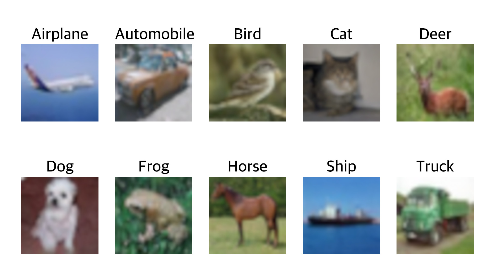

# DiffusionLab 🧠🧪

[](LICENSE)

An implementation of a generic model structure for **Denoising Diffusion Probabilistic Models (DDPM)** under
variable conditioning.

This project provides the basic structure of a diffusion process for both training and inference, using a generic
diffusion-wrapper. We inject an arbitrary U-Net backbone to power the process, providing a variable
conditioning (e.g. time + class label) by the wrapper.

All experiments can be replicated using the given notebooks under `notebooks/experiments`.

## Contents 📖

- [Results](#results)
- [Installation](#installation)
- [Usage](#usage)
- [License](#license)

## Results 🏆

### CIFAR-10

On the CIFAT-10 dataset various time and class conditioned models were implemented, showing increasing performance
by adapting the model architecture, noise schedule, training time, and the inference process.

**Learnings:**

- Small models (< 50M) start to learn basic structures for easy classes
- Larger models (~100M) achieve already better results with the same training configuration
- EMA Shadow Weights for inference leads to string improvements of the FID
- CosineNoiseSchedule outperformed LinearNoiseSchedule significantly
- On CIFAR-10 even smaller models (~250M) generate usable results with a few days of training (A100 GPU)

**Generated Samples:**

Generated with the [CNNDenoiser21](src/diffusion_playground/models/backbones/cnn_denoiser_21.py).



---

## Installation 🚀

To install the project, simply follow the standard Python process, clone, create venv, install
dependencies, let's go! 😉

```bash
python3 -m venv .venv
```

```bash
pip install -r requirements.txt
```

With these steps, the setup is completed and the given scripts as well as notebooks
can be executed.

## Usage ⚙️

### Package Structure

The `diffusion_playground` package is organized into several key modules, the most
important parts of which can be seen below.

```
diffusion_playground/
├── data_loader/                              # What does it do... It loads data 😮
│   ├── cifar_10_dataset.py
│   ├── imagenet.py
│   └── toy_dataset.py
├── diffusion/                                # Backward and forward diffusion process
│   ├── backward.py
│   ├── forward.py
│   ├── noise_schedule.py
│   └── training_utils.py
├── evaluation/                               # Generate samples for inspection and track metrics
│   ├── eval_cifar_10.py
│   ├── image_generation_results.py
│   ├── metrics_tracker.py
│   └── time_conditioned_model.py
├── models/                                   # Neural Network wrapper and backbones
│   ├── backbones/                            # Base-models that power the diffusion process
│   ├── cond_embedding.py
│   ├── time_and_class_conditioned_model.py
│   └── time_conditioned_model.py
└── training/                                 # Training infrastructure
    ├── denoiser_trainer.py
    └── utils.py
```

### Quick Start

To start an experiment, simply follow the implementations under `notebooks/experiments`
and e.g. train a diffusion model on the CIFAR-10 dataset.

To not constantly change this README, no code-snippets are provided here... these
change about as quickly as the most popular disruptive agentic AI tools for
increasing shareholder value 😉.

The notebooks include:

- Dataset loading (and exploration in relevant cases)
- Model architecture setup
- Training with automatic checkpointing
- Visualization of results
- Sample generation from checkpoints

## License 🛡️

This project is under the MIT-license. For more information, see [LICENSE](LICENSE).
