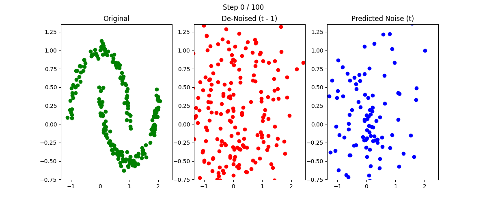
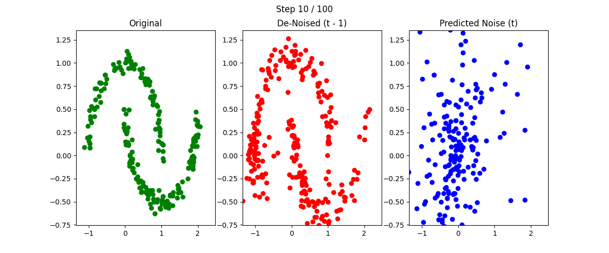
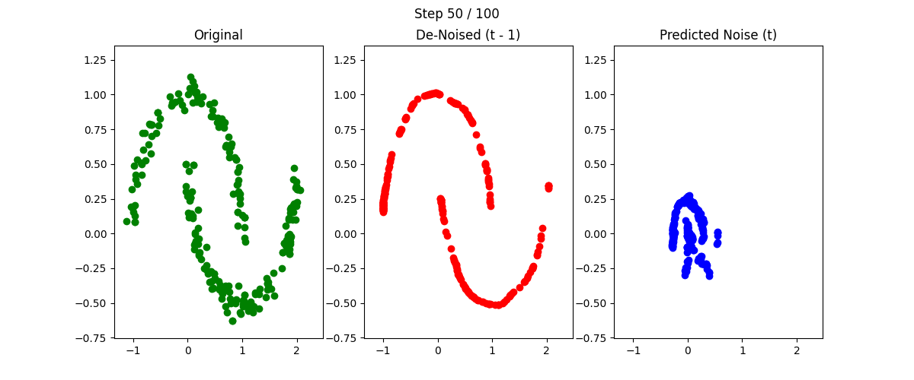
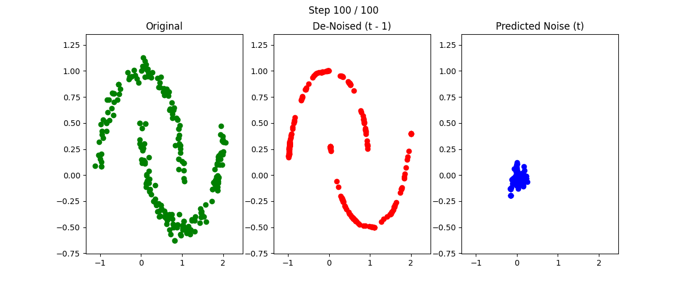

# MLP Denoiser - Small ⬇️

A simple linear model for a first experiment on the `moons` toy-dataset.

## Model Architecture 🏗️

```text
=================================================================
Layer (type:depth-idx)                   Param #
=================================================================
MLPDenoiser                              --
├─Sequential: 1-1                        --
│    └─Linear: 2-1                       512
│    └─ReLU: 2-2                         --
│    └─Linear: 2-3                       16,512
│    └─ReLU: 2-4                         --
│    └─Linear: 2-5                       258
=================================================================
Total params: 17,282
Trainable params: 17,282
Non-trainable params: 0
=================================================================
```

## Training🏋️

For this experiment, the toy dataset `moons` was used. The model was trained using
the following configuration.

| Parameter                  | Value        |
|----------------------------|--------------|
| Number of Data Samples     | 1'000        |
| Noise Scheduler Time Steps | 100          |
| Epochs to train            | 100'000      |
| Time to train              | 23 Seconds   |
| Device                     | Apple M3 CPU |

## Results 🏆

The small model showed a very good performance on the simple `moons` dataset and therefore
exemplified the general idea of the de-noising process very well.
The results of chosen de-noising steps out of a total of 100 can be seen below.



This first visualization shows the input data as pure noise without any diffusion process
applied at all.



Even after the first 10 out of 100 steps, we can see a clear improvement in the
distribution of the data points.



After 50 steps, the data looks already amost perfectly distributed, following the learned
pattern of the ground truth data seen on the lef (green).



After completing all 100 de-noising steps, the data shows a perfect pattern of the two
half-moons learned from the training set.
