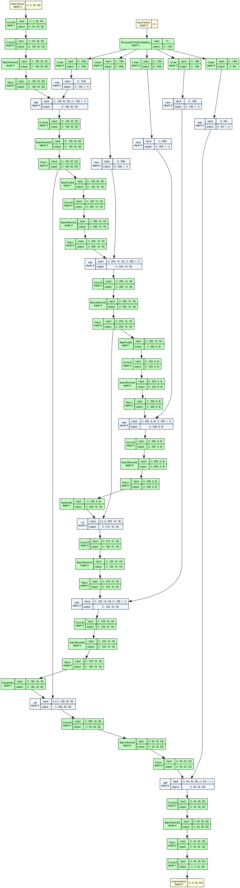
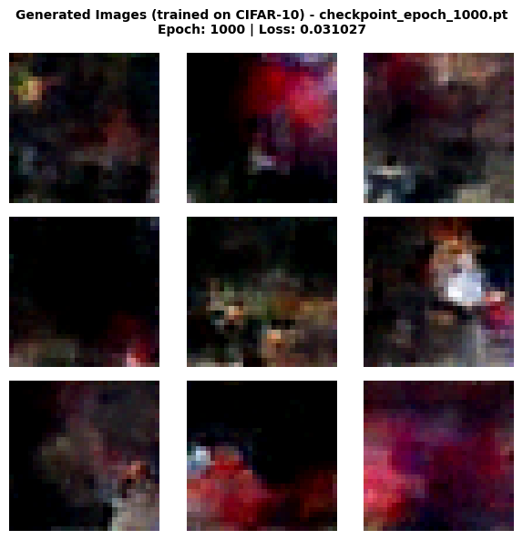
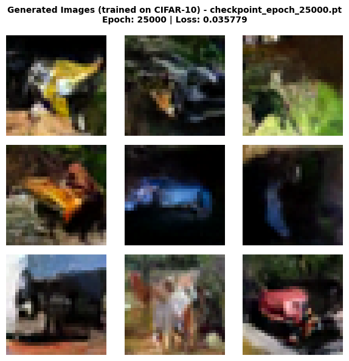
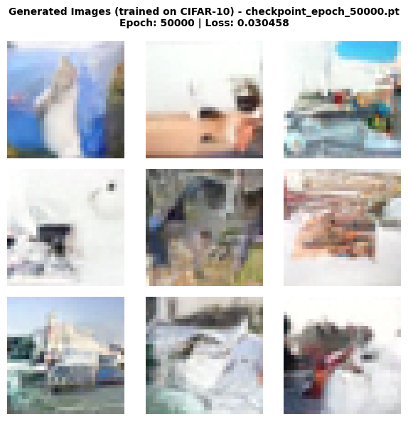
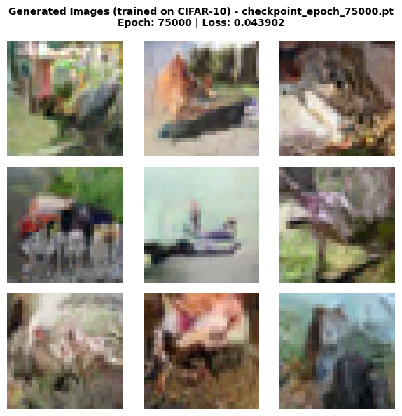
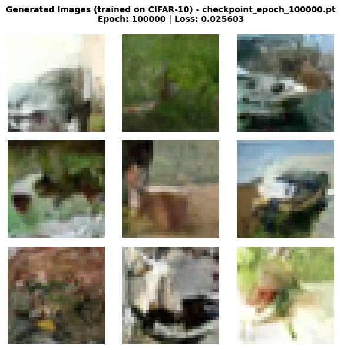

# CIFAR-10 Diffusion Model - Experiment Documentation

## Overview

This experiment implements a **Denoising Diffusion Probabilistic Model (DDPM)** trained on the CIFAR-10 dataset to
generate colored images of objects from pure noise. This represents a significant leap in complexity from MNIST:

- **Color images**: 3 channels (RGB) instead of 1 (grayscale)
- **Complex objects**: 10 diverse classes (airplanes, cars, birds, cats, deer, dogs, frogs, horses, ships, trucks)
- **Rich textures**: Real-world photographs with varying backgrounds and perspectives

This experiment demonstrates that our generic diffusion pipeline can scale to more complex image generation tasks.

## Architecture

### U-Net-style CNN Denoiser

For this experiment, we replicate the same architecture as in the MNIST example, with a higher
base-dimensionality, aiming to depict the more complex domain.



**Key Features:**

- **3-channel input/output** for RGB color images
- **Convolutional layers** preserve spatial structure and learn complex features
- **Skip connections** help preserve fine details from encoder to decoder
- **Sinusoidal time embeddings** condition the network on the current diffusion time step
- **BatchNorm + ReLU** for stable training

**Model Size:**

- Base channels: 64
- Time embedding dimension: 128
- Input channels: 3 (RGB)
- Total parameters: 3,321,475

### Time Conditioning

The model uses **sinusoidal time embeddings** to encode the current time step into a high-dimensional vector. This time
information is injected into each encoder and decoder block, allowing the network to adapt its denoising strategy based
on the noise level.

## Training Strategy

### Dataset

- **CIFAR-10 Training Set**: 50,000 color images (32×32 pixels)
- **Classes**: airplane, automobile, bird, cat, deer, dog, frog, horse, ship, truck
- **Normalization**: Scaled to [-1, 1] range per channel

### Noise Schedule

- **Type**: Linear schedule
- **Time steps**: T = 1,000
- **Beta range**: [1e-4, 0.02]

The schedule controls how quickly noise is added during the forward process. A linear schedule means the noise increases
steadily over the 1,000 time steps.

### Training Configuration

- **Optimizer**: Adam
- **Learning rate**: 1e-3
- **Batch size**: 128
- **Loss function**: MSE (Mean Squared Error) between predicted and actual noise
- **Training epochs**: 100,000 iterations

### Training Process

At each training step:

1. Sample a batch of real images from CIFAR-10
2. Randomly sample time steps t for each image
3. Add noise according to the schedule at time t (forward diffusion)
4. Train the model to predict the added noise across all 3 color channels
5. Update weights via backpropagation

The model learns to denoise at all time steps simultaneously through random sampling.

## Generation Process

To generate new images:

1. **Start**: Sample pure Gaussian noise $ x_T \sim N(0, I) $ with shape (3, 32, 32)
2. **Iterate**: For t = T down to 1:
    - Predict noise using the trained model: $ \hat{\epsilon} = model(x_t, t) $
    - Compute the mean of $ p(x_{t-1} | x_t) $
    - **Add stochastic noise** (except at t=1) for diversity
    - Update: $ x_{t-1} = mean + \sigma_t \cdot noise $
3. **Output**: Final denoised RGB image $ x_0 $

## Results

### Training Progression

The model was trained for 100,000 epochs with checkpoints saved at regular intervals. Below are generated samples
showing how quality improves with training:

#### Epoch 1,000 (Early Training)



At 1,000 epochs, the model is just beginning to learn. The generated images show mostly dark structures, no realistic
shapes can be seen at that stage, but some abstract forms start to emerge.

#### Epoch 25,000 (Early-Mid Training)



By 25,000 epochs, significant progress is visible! The model begins to learn **basic shapes and structures**:

- Vague object boundaries emerge
- Color regions become more coherent
- Spatial structure starts to form (sky vs ground, background vs foreground)

#### Epoch 50,000 (Mid Training)



At 50,000 epochs, the model shows improved shape learning compared to the checkpoints
before.

- Slowly we can guess a few categories in the generated images
- Color palettes match expected classes (blue water for ships, brown/tan for animals)

#### Epoch 75,000 (Advanced Training)



At 75,000 epochs, refinement continues:

- Objects become more defined and coherent
- Better separation between object and background
- Textures start to emerge - e.g. some images start to include shadows

#### Epoch 100,000 (Final Model)



After 100,000 epochs, the model produces even better results:

- **Better object shapes** for certain classes, like e.g. boats
- **Coherent colors** and spatial layouts
- **Diverse generations** across samples
- While far from photorealistic, the shapes and structures of CIFAR-10 objects are clearly learned

**Key Observation**: The model successfully learns to generate recognizable object shapes and structures! You can
slowly identify boats, animal legs (horses), vehicles, and other CIFAR-10 categories. This is remarkable progress for a
relatively simple U-Net architecture.

## Challenges and Observations

### Why Not Photorealistic Yet?

Training diffusion models on complex datasets like CIFAR-10 is significantly harder than MNIST because:

1. **Higher Dimensionality**: 32×32×3 = 3,072 dimensions vs 28×28×1 = 784 for MNIST (~4x more complex)
2. **Complex Textures**: Real-world photographs have rich textures, lighting, and variations
3. **Multiple Object Classes**: The model must learn 10 distinct object categories simultaneously
4. **Limited Architecture**: Our U-Net is relatively small (~3M parameters) compared to state-of-the-art models

### What's Working Well

✅ **Shape Learning**: The model clearly learns object shapes (boats, horses, vehicles)
✅ **Color Structure**: Appropriate colors for different object categories
✅ **Spatial Coherence**: Objects have proper structure (e.g., animals have legs)
✅ **Diversity**: Different samples show variety in generated objects

### Future Improvements

To achieve photorealistic generation, consider:

- **Larger Architecture**: Increase model capacity (more channels, deeper network)
- **More Training**: Extend to 500K-1M epochs
- **Better Schedule**: Experiment with cosine noise schedules
- **Conditional Generation**: Add class labels to guide generation (class-conditional DDPM)
- **Advanced Techniques**: Implement classifier-free guidance, DDIM sampling, or latent diffusion

## Generic Training Pipeline

One of the key achievements of this project is the **generic training pipeline**. The same `train_denoiser()` function
works seamlessly for:

- 2D toy datasets (Moons) with MLP
- Grayscale images (MNIST) with CNN
- **Color images (CIFAR-10) with RGB CNN**

The only changes needed:

1. Model architecture (adjusted input/output channels)
2. Dataset (CIFAR-10 instead of MNIST)
3. Image shape (3, 32, 32) instead of (1, 28, 28)

The abstraction successfully scales to more complex data! 🎉

## Technical Implementation

### Key Components

1. **`CNNDenoiser`** (`src/diffusion_playground/models/cnn_denoiser.py`)
    - U-Net-style architecture
    - Configurable input channels (1 for grayscale, 3 for RGB)
    - Sinusoidal time embeddings
    - Skip connections between encoder and decoder

2. **`LinearNoiseSchedule`** (`src/diffusion_playground/diffusion/noise_schedule.py`)
    - Computes $ \beta_t $, $ \alpha_t $, and $ \hat{\alpha}_t $ for each time step

3. **`train_denoiser()`** (`src/diffusion_playground/training/denoiser_trainer.py`)
    - Generic training loop
    - Automatic checkpointing and resume
    - Works with any model that follows the interface

4. **`generate_samples()`** (`src/diffusion_playground/diffusion/backward.py`)
    - Reverse diffusion process
    - Stochastic sampling for diversity

5. **`generate_samples_from_checkpoints()`** (`src/diffusion_playground/visualization/image_generation_results.py`)
    - Automated visualization generation
    - Handles both grayscale and RGB images

### Running the Experiment

1. **Training**:
   ```python
   from src.diffusion_playground.models import CNNDenoiser
   from src.diffusion_playground.training.denoiser_trainer import train_denoiser
   from src.diffusion_playground.diffusion import LinearNoiseSchedule

   # Create model for RGB images
   model = CNNDenoiser(in_channels=3, base_channels=32, time_emb_dim=128)

   # Create noise schedule
   schedule = LinearNoiseSchedule(time_steps=1_000)

   # Train
   train_denoiser(
       model=model,
       data=cifar10_data,
       noise_schedule=schedule,
       epochs=100_000,
       checkpoint_dir="checkpoints/cifar10_cnn",
       save_every=1_000
   )
   ```

2. **Generation**:
   ```python
   from src.diffusion_playground.diffusion import generate_samples
   from src.diffusion_playground.training.denoiser_trainer import load_checkpoint

   # Load checkpoint
   model = CNNDenoiser(in_channels=3, base_channels=32, time_emb_dim=128)
   load_checkpoint(model, "checkpoints/cifar10_cnn/best_model.pt", device=device)

   # Generate samples
   generated_images = generate_samples(
       model=model,
       noise_schedule=schedule,
       image_shape=(3, 32, 32),
       num_samples=16,
       device=device
   )
   ```

3. **Batch Visualization**:
   ```python
   from src.diffusion_playground.visualization.image_generation_results import generate_samples_from_checkpoints

   generate_samples_from_checkpoints(
       model=model,
       device=device,
       checkpoint_epochs=[1000, 25000, 50000, 75000, 100000],
       checkpoint_dir="checkpoints/cifar10_cnn",
       output_dir="docs/cifar-10-cnn",
       noise_schedule=schedule,
       image_shape=(3, 32, 32),
       cmap=None  # RGB images
   )
   ```

See the full implementation in [`cifar10_diffusion.ipynb`](./cifar10_diffusion.ipynb).

## Conclusion

This experiment successfully demonstrates that:

- ✅ Diffusion models can learn to generate color images with complex objects
- ✅ The model learns **recognizable shapes** (boats, horses, vehicles, animals)
- ✅ U-Net architecture scales from grayscale to RGB images
- ✅ The generic training pipeline works across different datasets and modalities
- ✅ Even a relatively simple model can capture meaningful structure in complex data

### Next Steps:

- Experiment with larger architectures
- Try conditional generation (class-guided)
- Implement advanced sampling techniques (DDIM, classifier-free guidance)
- Scale to higher resolutions

---

**Experiment Date**: February 2026

**Training Hardware**: Google Colab T4 GPU

**Total Training Time**: 100,000 epochs - No time measuring, interrupted across a few days

**Framework**: PyTorch 2.x

**Achievement Unlocked**: First colored image diffusion model! 🎨✨
