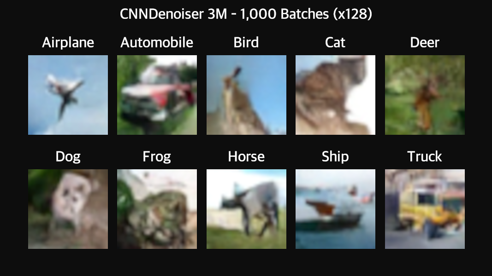
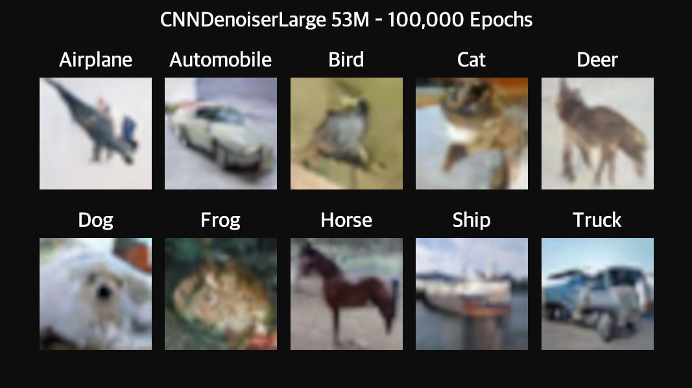
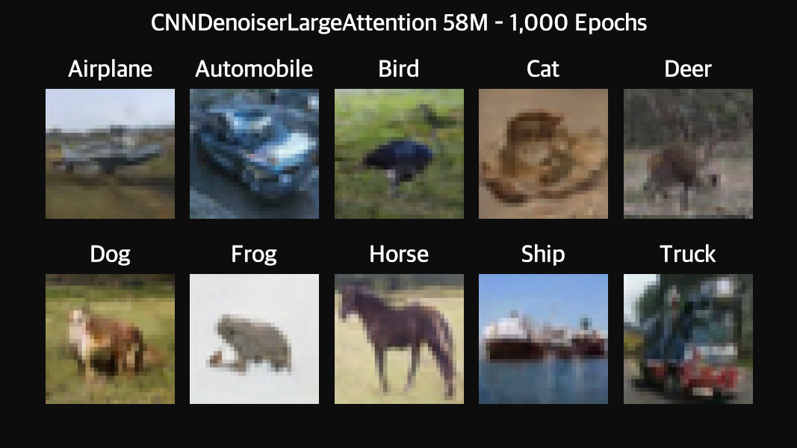

# CIFAR-10 Diffusion Model - Experiment Documentation

## Overview

This experiment aims to evaluate the image generation capabilities of CNN-based models,
following the U-Net approach and conditioned both on time-step and the class label
of the COFAR-10 dataset for controlled image generation.

## Used Models

The specific models used in this experiment are the backbones

- [CNNDenoiser](../../../src/diffusion_playground/models/backbones/cnn_denoiser.py) (3M)
- [CNNDenoiserLarge](../../../src/diffusion_playground/models/backbones/cnn_denoiser_large.py) (53M)
- [CNNDenoiserLargeAttention](../../../src/diffusion_playground/models/backbones/cnn_denoiser_large_attention.py) (58M)

embedded into the model wrapper for time- and class-conditioning
[TimeAndClassConditionedModel](../../../src/diffusion_playground/models/time_and_class_conditioned_model.py).

## Noise Schedule

As a noise schedule, the following configuration was used.

- **Type**: Linear schedule
- **Time steps**: T = 1,000
- **Beta range**: [1e-4, 0.02]

## Dataset

- **CIFAR-10 Training Set**: 50,000 color images (32×32 pixels)
- **Classes**: airplane, automobile, bird, cat, deer, dog, frog, horse, ship, truck
- **Normalization**: Scaled to [-1, 1] range per channel

## Training Configuration

- **Optimizer**: Adam
- **Learning rate**: 1e-3
- **Batch size**: 128
- **Loss function**: MSE (Mean Squared Error) between predicted and actual noise
- **Training epochs**: 100,000 iterations

## Training Process

At each training step:

1. Sample a batch of real images from CIFAR-10
2. Randomly sample time steps t for each image
3. Add noise according to the schedule at time t (forward diffusion)
4. Train the model to predict the added noise across all 3 color channels, conditioned on the given class label y
5. Update weights via backpropagation

## Results

The models have been trained for 100,000 epochs, resulting in the following capabilities
for image generation.

Below you can see the results of the models 3M and 53M for all 10 different CIFAR-10 class labels.

### 3M Model

### 53M Model

### 58M Model + Attention

## Challenges and Observations

We see, that the training is particularly hard for certain classes like Frog, Cat, and Dog, while
e.g. the class Automobile can be generated well better. The generated images start to look like
the desired classes, while certainly not showing sufficient quality yet.

Still we see, that the larger model does indeed perform better than the smaller one.
This indicates, that a larger and more sophisticated architecture than the currently
implemented CNNDenoiser(Large) might be beneficial to use for future attempts. Note,
that the current models are very simple, with a basic U-Net + Sinusoidal Time Embedding + Label
Embedding and can (and must) be extended in the future.

## What's Working Well

✅ **Shape Learning**: The model clearly learns object shapes (boats, horses, vehicles)
✅ **Color Structure**: Appropriate colors for different object categories
✅ **Spatial Coherence**: Objects have proper structure (e.g., animals have legs)
✅ **Diversity**: Different samples show variety in generated objects

## Technical Components

1. **`CNNDenoiser`** (`src/diffusion_playground/models/cnn_denoiser.py`)
    - U-Net-style architecture
    - Configurable input channels (1 for grayscale, 3 for RGB)
    - Sinusoidal time embeddings
    - Skip connections between encoder and decoder

2. **`CNNDenoiserLarge`** (`src/diffusion_playground/models/cnn_denoiser_large.py`)
    - Larger version of the CNNDenoiser
    - 1 additional down- and up-sampling step
    - Higher base dimension (64 -> 128)

2. **`LinearNoiseSchedule`** (`src/diffusion_playground/diffusion/noise_schedule.py`)
    - Computes $ \beta_t $, $ \alpha_t $, and $ \hat{\alpha}_t $ for each time step

3. **`train_denoiser()`** (`src/diffusion_playground/training/denoiser_trainer.py`)
    - Generic training loop
    - Automatic checkpointing and resume
    - Works with any model that follows the interface

4. **`generate_samples()`** (`src/diffusion_playground/diffusion/backward.py`)
    - Reverse diffusion process
    - Stochastic sampling for diversity

5. **`generate_samples_from_checkpoints()`** (`src/diffusion_playground/visualization/image_generation_results.py`)
    - Automated visualization generation
    - Handles both grayscale and RGB images

## Conclusion

This experiment successfully demonstrates that:

- ✅ Diffusion models can learn to generate color images with complex objects
- ✅ The model learns **recognizable shapes** (boats, horses, vehicles, animals)
- ✅ U-Net architecture scales from grayscale to RGB images
- ✅ The generic training pipeline works across different datasets and modalities
- ✅ Even a relatively simple model can capture meaningful structure in complex data

---

**Experiment Date**: February 2026

**Training Hardware**: Google Colab T4 GPU

**Framework**: PyTorch 2.x

**Achievement Unlocked**: First colored image diffusion model! 🎨✨
