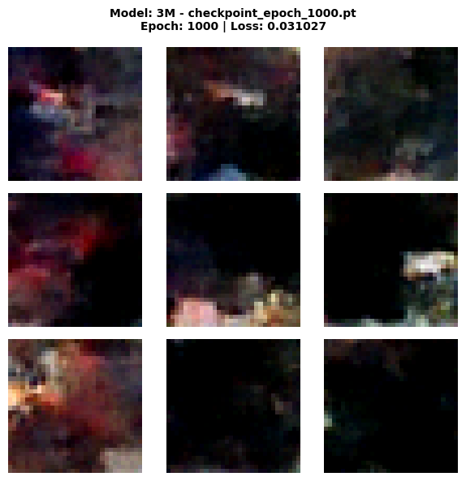
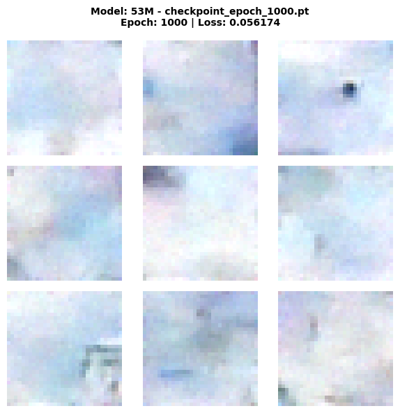
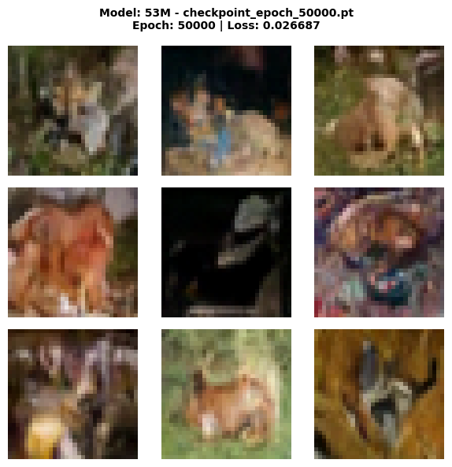
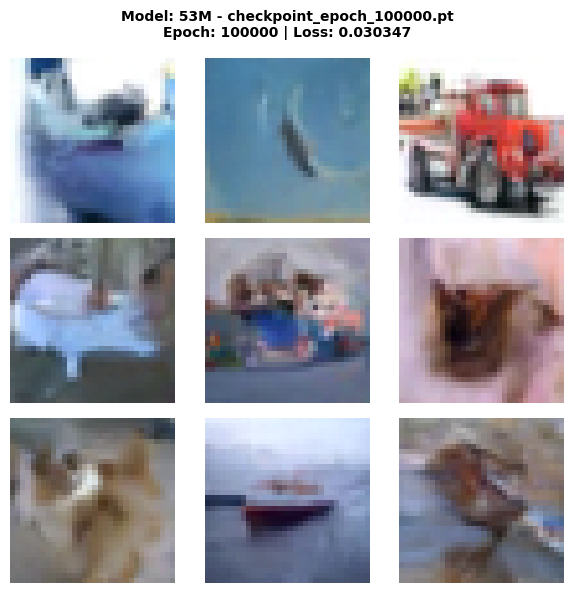

# CIFAR-10 Diffusion Model - Experiment Documentation

## Overview

This experiment implements a **Denoising Diffusion Probabilistic Model (DDPM)** trained on the CIFAR-10 dataset to
generate colored images of objects from pure noise. This represents a significant leap in complexity from MNIST:

- **Color images**: 3 channels (RGB) instead of 1 (grayscale)
- **Complex objects**: 10 diverse classes (airplanes, cars, birds, cats, deer, dogs, frogs, horses, ships, trucks)
- **Rich textures**: Real-world photographs with varying backgrounds and perspectives

This experiment demonstrates that our generic diffusion pipeline can scale to more complex image generation tasks.

## Architecture

### U-Net-style CNN Denoiser

For this experiment, we replicate the same architecture as in the MNIST example, with a higher
base-dimensionality, aiming to depict the more complex domain.

The model graph (**small version!**) can be
seen [here](../../../docs/models/cnn-denoiser/CNNDenoiserGraph.png).

**Key Features:**

- **3-channel input/output** for RGB color images
- **Convolutional layers** preserve spatial structure and learn complex features
- **MaxPooling layers** for down-sampling
- **Upsample layers** for... well up-sampling 😉
- **Skip connections** help preserve fine details from encoder to decoder
- **Sinusoidal time embeddings** condition the network on the current diffusion time step
- **BatchNorm + ReLU** for stable training

### Model Versions

For more information on the different models CNNDenoiser (3M) and CNNDenoiserLarge (53M)
see the respective [README](../../../src/diffusion_playground/models/README.md).

## Training Strategy

### Dataset

- **CIFAR-10 Training Set**: 50,000 color images (32×32 pixels)
- **Classes**: airplane, automobile, bird, cat, deer, dog, frog, horse, ship, truck
- **Normalization**: Scaled to [-1, 1] range per channel

### Noise Schedule

- **Type**: Linear schedule
- **Time steps**: T = 1,000
- **Beta range**: [1e-4, 0.02]

The schedule controls how quickly noise is added during the forward process. A linear schedule means the noise increases
steadily over the 1,000 time steps.

### Training Configuration

- **Optimizer**: Adam
- **Learning rate**: 1e-3
- **Batch size**: 128
- **Loss function**: MSE (Mean Squared Error) between predicted and actual noise
- **Training epochs**: 100,000 iterations

### Training Process

At each training step:

1. Sample a batch of real images from CIFAR-10
2. Randomly sample time steps t for each image
3. Add noise according to the schedule at time t (forward diffusion)
4. Train the model to predict the added noise across all 3 color channels
5. Update weights via backpropagation

## Results

### Comparison of models

Both models were trained for 100,000 epochs with checkpoints saved each 1,000 epochs. Below are generated samples
showing how quality improves with training and comparing both model variants (3M - small and 53M - large):

#### After 1,000 Epochs

**CNNDenoiser - 3M**



**CNNDenoiserLarge - 53M**



#### After 50,000 Epochs

**CNNDenoiser - 3M**


**CNNDenoiserLarge - 53M**



#### After 100,000 Epochs

**CNNDenoiser - 3M**


**CNNDenoiserLarge - 53M**



## Challenges and Observations

### Why Not Photorealistic Yet?

Training diffusion models on complex datasets like CIFAR-10 is significantly harder than MNIST because:

1. **Higher Dimensionality**: 32×32×3 = 3,072 dimensions vs 28×28×1 = 784 for MNIST (~4x more complex)
2. **Complex Textures**: Real-world photographs have rich textures, lighting, and variations
3. **Multiple Object Classes**: The model must learn 10 distinct object categories simultaneously
4. **Limited Architecture**: Both U-Net models are still far too small compared to state-of-the-art models

### What's Working Well

✅ **Shape Learning**: The model clearly learns object shapes (boats, horses, vehicles)
✅ **Color Structure**: Appropriate colors for different object categories
✅ **Spatial Coherence**: Objects have proper structure (e.g., animals have legs)
✅ **Diversity**: Different samples show variety in generated objects

## Technical Implementation

### Key Components

1. **`CNNDenoiser`** (`src/diffusion_playground/models/cnn_denoiser.py`)
    - U-Net-style architecture
    - Configurable input channels (1 for grayscale, 3 for RGB)
    - Sinusoidal time embeddings
    - Skip connections between encoder and decoder

2. **`CNNDenoiserLarge`** (`src/diffusion_playground/models/cnn_denoiser_large.py`)
    - Larger version of the CNNDenoiser
    - 1 additional down- and up-sampling step
    - Higher base dimension (64 -> 128)

2. **`LinearNoiseSchedule`** (`src/diffusion_playground/diffusion/noise_schedule.py`)
    - Computes $ \beta_t $, $ \alpha_t $, and $ \hat{\alpha}_t $ for each time step

3. **`train_denoiser()`** (`src/diffusion_playground/training/denoiser_trainer.py`)
    - Generic training loop
    - Automatic checkpointing and resume
    - Works with any model that follows the interface

4. **`generate_samples()`** (`src/diffusion_playground/diffusion/backward.py`)
    - Reverse diffusion process
    - Stochastic sampling for diversity

5. **`generate_samples_from_checkpoints()`** (`src/diffusion_playground/visualization/image_generation_results.py`)
    - Automated visualization generation
    - Handles both grayscale and RGB images

### Running the Experiment

1. **Training**:
   ```python
   from src.diffusion_playground.models import CNNDenoiser
   from src.diffusion_playground.training.denoiser_trainer import train_denoiser
   from src.diffusion_playground.diffusion import LinearNoiseSchedule

   # Create model for RGB images
   model = CNNDenoiser(in_channels=3, base_channels=32, time_emb_dim=128)

   # Create noise schedule
   schedule = LinearNoiseSchedule(time_steps=1_000)
   
   # Load the data
   data = ...

   # Train
   train_denoiser(
       model=model,
       data=data,
       noise_schedule=schedule,
       epochs=100_000,
       lr=1e-3,
       batch_size=128,
       checkpoint_dir="checkpoints/model_name",
       save_every=1_000,
       resume=True,
   )
   ```

2. **Generation**:
   ```python
   from src.diffusion_playground.diffusion import generate_samples
   from src.diffusion_playground.training.denoiser_trainer import load_checkpoint

   # Load checkpoint
   model = CNNDenoiser(in_channels=3, base_channels=32, time_emb_dim=128)
   load_checkpoint(model, "checkpoints/cifar10_cnn/best_model.pt", device=device)

   # Generate samples
   generated_images = generate_samples(
       model=model,
       noise_schedule=schedule,
       image_shape=(3, 32, 32),
       num_samples=9,
       device=device
   )
   ```

3. **Batch Visualization**:
   ```python
   from src.diffusion_playground.visualization.image_generation_results import generate_samples_from_checkpoints

   # Generate the samples
   generate_samples_from_checkpoints(
       model=model,
       model_name="53M",
       device="cpu",
       checkpoint_epochs=[1000],  # add [25000, 50000, 75000, 100000]
       checkpoint_dir="./checkpoints/model_name",
       output_dir="../../../docs/experiment-name/model-name",
       noise_schedule=schedule,
       image_shape=(3, 32, 32),
   )
   ```

See the full implementation of the large model version in [cnn_denoiser_large.ipynb](./cnn_denoiser_large.ipynb).

## Conclusion

This experiment successfully demonstrates that:

- ✅ Diffusion models can learn to generate color images with complex objects
- ✅ The model learns **recognizable shapes** (boats, horses, vehicles, animals)
- ✅ U-Net architecture scales from grayscale to RGB images
- ✅ The generic training pipeline works across different datasets and modalities
- ✅ Even a relatively simple model can capture meaningful structure in complex data

---

**Experiment Date**: February 2026

**Training Hardware**: Google Colab T4 GPU

**Framework**: PyTorch 2.x

**Achievement Unlocked**: First colored image diffusion model! 🎨✨
