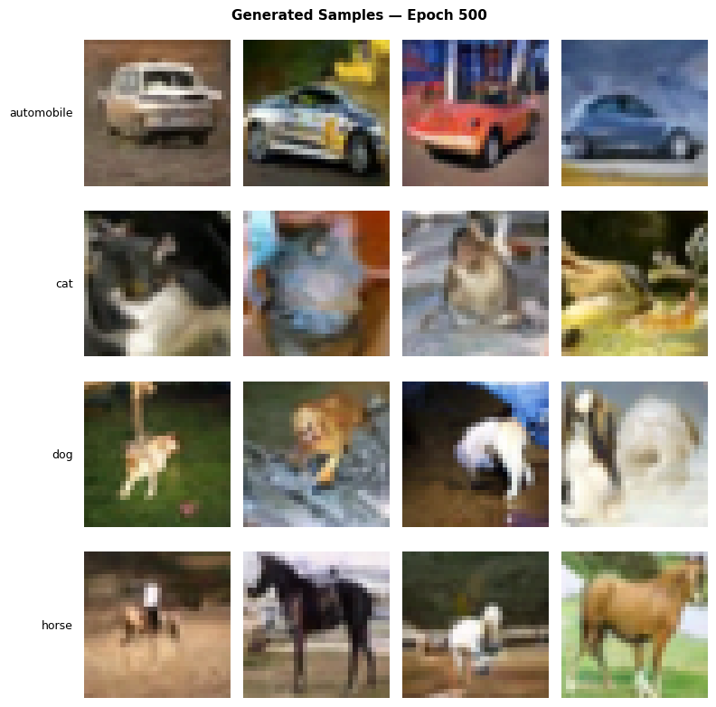
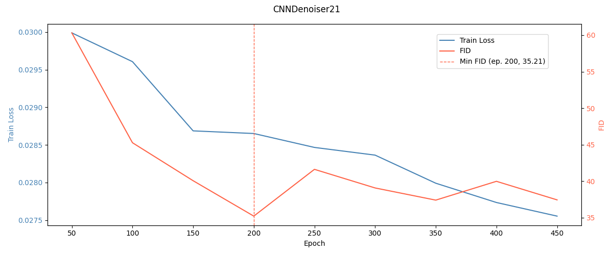
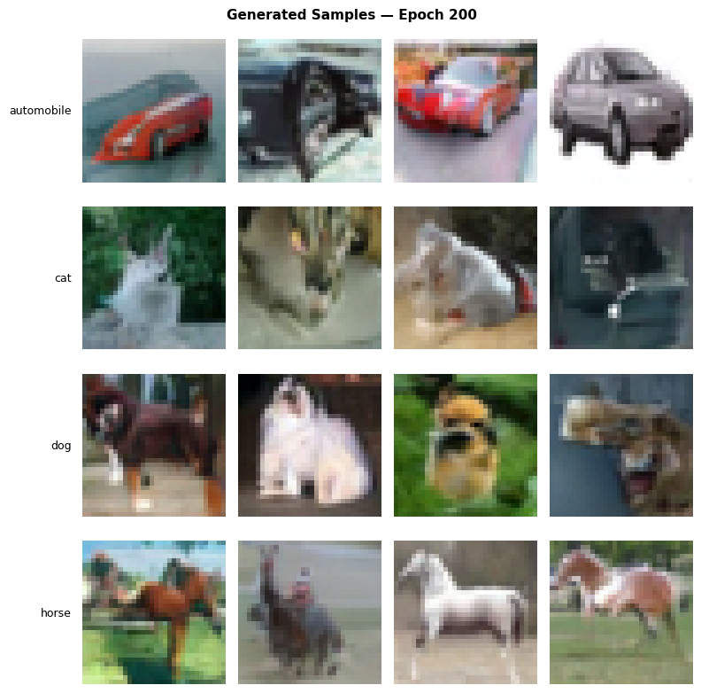
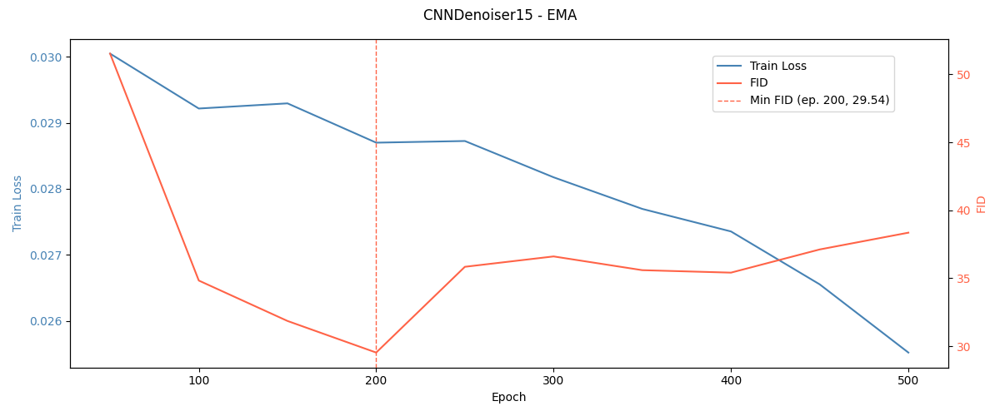
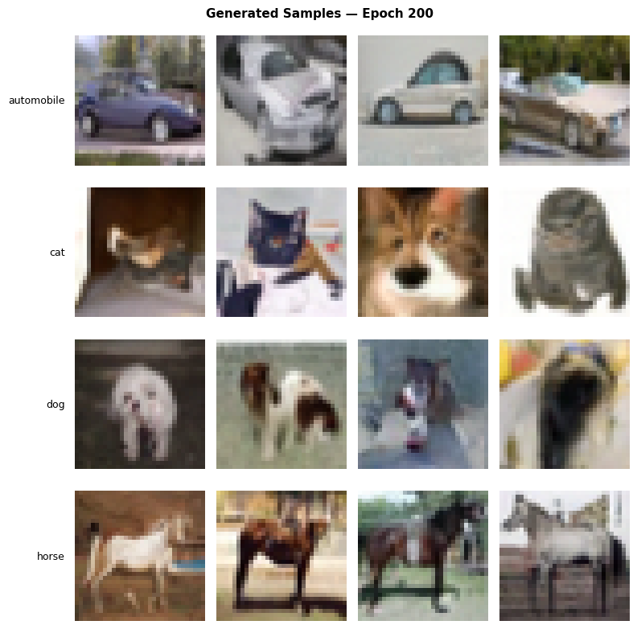
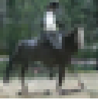
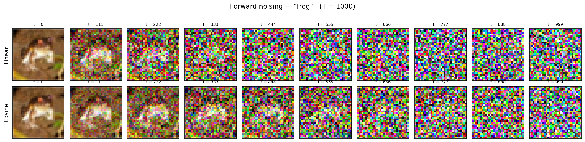
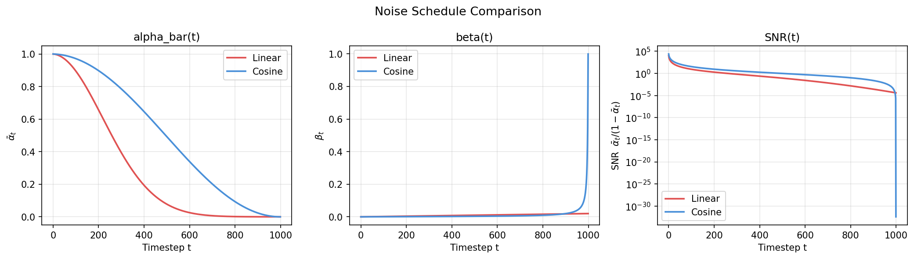
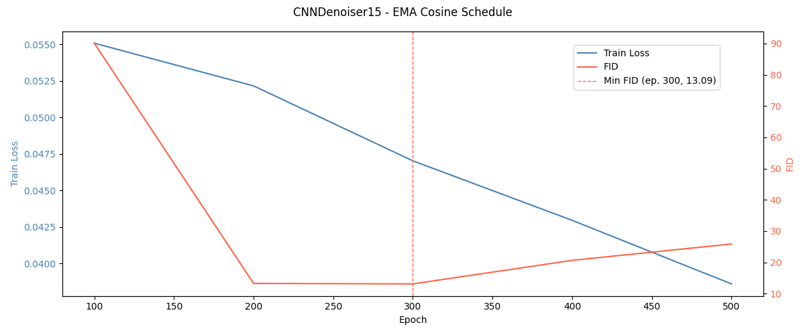
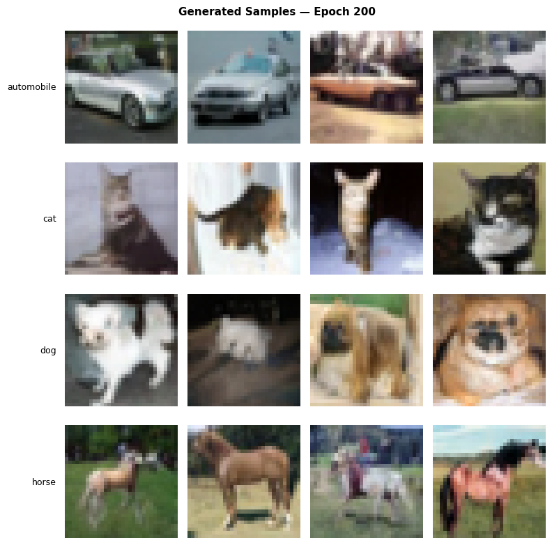

# Evolution of the CIFAR-10 Experiments

This file gives an overview about the results and evolution of architecture and training process
for handling the CIFAR-10 dataset in the task of image generation using U-Net style diffusion
models.

## General Architecture

To make it easy to switch out backbone models while keeping time and class conditioning,
the architecture was implemented such that backbone models implement the `BaseBackbone`
interface. This generalizes the idea, that every backbone's forward pass method
takes an input `x` as well as a conditional embedding `cond_emb` as an input. The
conditional embedding is here provided by the wrapper and therefore either realized
as a pure time conditional or as a time and class conditional embedding.

For the experiments described below, a time and class conditional embedding was used.

## 1. Small CNNDenoiser as a PoC

To test the general process, a small CNN-based U-Net was implemented.

### Architecture

**Time Embedding:** SinusoidalTimeEmbedding (128 embedding dimension)

**Backbone-Architecture:**

```text
Input
-> Init-Conv

-> Down1
-> Pool1

-> Down2
-> Pool2

-> Bottleneck

-> Up-sampling1
-> Up1 + Res

-> Up-sampling2
-> Up2 + Res

-> Out-Conv
```

➡️ Total number of parameters: 13M

**Backbone-Configuration:** 128 Base-Channels

**Training-Configuration:**

| Parameter     | Value |
|---------------|-------|
| Learning Rate | 1e-3  |
| Batch-Size    | 128   |

### Results

The FID- and Loss-Curve can be seen below.


We see, that the FID starts to level off after around 300 epochs and even though the loss further
decreases, the quality of the generated images based on the FID metric does not improve
anymore. This leads to the conclusion, that the model indeed learns, but is not capable
of depicting the CIFAR-10 dataset in a generation process well enough yet.

**Samples at the best FID score (epoch 300):**


The samples are not yet recognizable, besides some features in e.g. the class `automobile`.

## 2. CNNDenoiserLargeAttention

At this point, congrats to me for the amazing naming of this model 😉.
The *CNNDenoiserLargeAttention* implements a deeper model architecture, together with
introduced self-attention blocks at certain stages.

### Changed Architecture

```text
Input
-> Init-Conv

-> Down1
-> Pool1

-> Down2
-> Pool2

-> Down3
-> Pool3

-> Bottleneck
-> Attention

-> Up-sampling1
-> Up1 + Res
-> Attention

-> Up-sampling2
-> Up2 + Res

-> Up-sampling3
-> Up3 + Res

-> Out-Conv
```

➡️ Total number of parameters: 58M

### Results

The FID- and Loss-Curve can be seen below.


The FID score shows a lower minimum, indicating a better result in generating images based
on CIFAR-10. Still, we see a levelling off after again about 300 epochs at a not yet sufficient
quality. A little bit of research about the used models in the original DDPM paper shows, that
the backbone architecture seems to be too shallow. Deeper models will be applied in further
experiments.

**Samples at the best FID score (epoch 275):**


The samples are way more recognizable, compared to the result of the 8M model (CNNDenoiser)
above. A significantly better performance can be seen at `Automobile` and `Horse` compared
to the other classes. Still, the images lack realism.

For further experiments, even deeper models will be considered.

## 3. CNNDenoiser15

This model finally changes the naming, with the number `15` indicating the number of
convolutional blocks in the entire network. While increasing spatial processing, the
architecture in this experiment avoided further reducing spatial resolution, as the
bottleneck layers already process feature maps of only the size `4x4xC`.

### Architecture

```text
Input
-> Init-Conv

-> Down1a
-> Down1b
-> Pool1

-> Down2a
-> Down2b
-> Pool2

-> Down3a
-> Down3b
-> Pool3

-> Bottleneck
-> Attention
-> Bottleneck
-> Attention
-> Bottleneck

-> Up-sampling1
-> Up1b + Res
-> Attention
-> Up1a + Res

-> Up-sampling2
-> Up2b + Res
-> Attention
-> Up2a + Res

-> Up-sampling3
-> Up3b + Res
-> Up3a + Res

-> Out-Conv
```

This sums up to

```text
Encoder: 2 x 3 = 6 Conv Blocks
Bottleneck: 3 Conv Blocks
Decoder: 2 x 3 = 6 Conv Blocks

-> Total: 6 + 3 + 6 = 15 Conv Blocks
```

➡️ Total number of parameters: 172M

### Results

The curves of the FID and Training Loss can be seen below.


In this experiment we see that the FID decreases more steadily, we achieve a smaller value of
36.75. Still, the curve seems to level off again after around 300 epochs.

### Samples



The samples of this model look way better for all classes, again especially for
`Automobile` and `Horse` which seem to be well learnable. We can also see good samples for
`Dog` and at least some recognizable structures for the class `Cat`.

## 4. CNNDenoiser21

This model implements an even deeper architecture, using one more conv layer per
Down- and Up-Block.

### Training Parameters

For this training run, the batch size was reduced from `128` to `64` due to the increasing
vRAM utilization that comes with the larger model size.

### Architecture

```text
Input
-> Init-Conv

-> Down1a
-> Down1b
-> Down1c
-> Pool1

-> Down2a
-> Down2b
-> Down2c
-> Pool2

-> Down3a
-> Down3b
-> Down3c
-> Pool3

-> Bottleneck
-> Attention
-> Bottleneck
-> Attention
-> Bottleneck

-> Up-sampling1
-> Up1c + Res
-> Up1b + Res
-> Attention
-> Up1a + Res

-> Up-sampling2
-> Up2c + Res
-> Up2b + Res
-> Attention
-> Up2a + Res

-> Up-sampling3
-> Up3c + Res
-> Up3b + Res
-> Up3a + Res

-> Out-Conv
```

➡️ Total number of parameters: 237M

### New Residual Connections within Down-/Up-Blocks

Besides the additional layers at each sampling stage, this model also implements a SiLU
and a residual projection from the input to the final output layer within each Down- and
Up-Block.

### Addition

During training, we could see an exploding gradient, causing the loss to suddenly increase
from about 0.3 in one epoch to 521934630431864.500000 in the next epoch... that's definetly
not as it should be 😅.

To counter that, a gradient clipping was added to prevent a single large gradient
from causing this explosion in further gradients throughout the network.

```python
torch.nn.utils.clip_grad_norm_(model.parameters(), max_norm=1.0)
```

An initial value of `max_norm = 1.0` was tried out in the first experiment.

Besides that, the Learning Rate was reduced from `1e-3` to `2e-4` in combination
with an `AdamW` Optimizer with Weight Decay.

### Results

After implementing the adaptions mentioned above, the model training was stable and the following
values for FID and Training-Loss have been achieved.



Note, that although the FID curve wiggles a little bit and appears to level off after 200 epochs,
the Training-Loss is nicely decreasing, which could motivate training for more epochs.

### Samples

The below samples were generated by the model after 200 epochs (best FID).



We can see, that e.g. the last sample for the class `automobile` lacks geometric correctness
(if it can be said like that 😅) and the model does not seem to significantly progress compared
to the `CNNDenoiser15`.

## Adaptions to the Training Process

After observing good progress but levelling off at a FID score
of still over 30, The following adaptions to the training process have been made.

### EMA - Moving Average Weights for Evaluation

The evaluation of the model was so far performed on the raw model weights.
To achieve better results, an Exponentially Weighted Moving Average (EMA)
was implemented which is often times seen in implementations of this
model online.

### Longer Training

As the training loss is nicely decreasing and the model already has
a good size, I decided to simply tryout training for more epochs
and hope and pray that the FID score will follow its Training-Loss
colleague and further decrease as well 😉.

## CNNDenoiser15 - EMA Evaluation

The training of the smaller CNNDenoiser15 model with a total of
15 Conv Blocks and 172M parameters led to the following FID- and
(Training-)Loss-Curves.

Note: Due to vRAM restrictions, the number of samples used for
calculating the FID score was reduced from 2048 to 1500.

The curves for the Training-Loss and the FID score every 50 epochs can be
seen below.



Note, that a pattern can be seen across all experiments that we conducted so far!
It seems like even though the Training-Loss decreases steadily, the FID score
starts to level off pretty quickly! Why is that? 🧐

The results of the model using EMA shadow-weights for denoising can be seen below.



The results look better than without EMA evaluation, which can also be seen
if we compare the best FID values of the same model CNNDenoiser15 with and
without this addition.

| Version | Minimum FID |
|---------|-------------|
| No-EMA  | 36.75       |
| EMA     | 29.54       |

Still, many samples lack important features or, again especially at the examples
of the classes `cat` and `dog` that the image is still warped / unclear.

**Small Addition:**

After 500 epochs, the EMA version of the CNNDenoiser15 actually created a person
riding a horse!



...I was happy about that, so I just wanted to point that out 🥳.

## CNNDenoiser15 - CosineNoiseSchedule

So the model is not performing to its greatest... How do we tackle this? 🧐

For this next experiment, a cosine-based noise schedule is implemented,
as proposed in the paper `Improved Denoising Diffusion Probabilistic Models`.

The implementation can be found [here](../../../src/diffusion_playground/diffusion/noise_schedule.py).

When applying both the linear and the cosine noise schedule besides each other
we can see, that the noise is less aggressive, preserving the information in
the image a little bit longer.



This is also shown by the curves, visualizing $ \bar{\alpha}_t $,
$ \beta_t $, as well as $ SNR(t) $ which is the Signal-to-Noise ratio at
the time step $ t $.
Here, especially the middle part is interesting, as the signal is preserved
longer with the cosine schedule. This should enable the model to learn
the structure better, not only seeing pure noise after being about $ 66\% $
through the schedule.



### Results of CNNDenoiser15 + EMA + Cosine-Schedule

During training, the following results were collected.



We see, that the minimum FID score is way better compared to the previous results,
with a minimum value of 13.09!

Still we see again, that the FID levels off after only a few hundred epochs.

When looking at the resulting generated images (again for the same classes
automobile, cat, dog, horse) we can observe a significantly better quality
for the class *cat*.



To further try to push down the FID score and achieve better generation results,
the larger `CNNDenoiser21` was trained, using the `CosineNoiseSchedule`.

## CNNDenoiser21 - CosineNoiseSchedule

...

# Not yet trained

## 5. CNNDenoiser27

Similar to the model before, this implementation also includes another convolutional block
per Down- and Up-Block.

### Architecture

```text
Input
-> Init-Conv

-> Down1a
-> Down1b
-> Down1c
-> Down1d
-> Pool1

-> Down2a
-> Down2b
-> Down2c
-> Down2d
-> Pool2

-> Down3a
-> Down3b
-> Down3c
-> Down3d
-> Pool3

-> Bottleneck
-> Attention
-> Bottleneck
-> Attention
-> Bottleneck

-> Up-sampling1
-> Up1d
-> Up1c
-> Up1b
-> Attention
-> Up1a

-> Up-sampling2
-> Up2d
-> Up2c
-> Up2b
-> Attention
-> Up2a

-> Up-sampling3
-> Up3d
-> Up3c
-> Up3b
-> Up3a

-> Out-Conv
```

➡️ Total number of parameters: 302M

### Results

...
