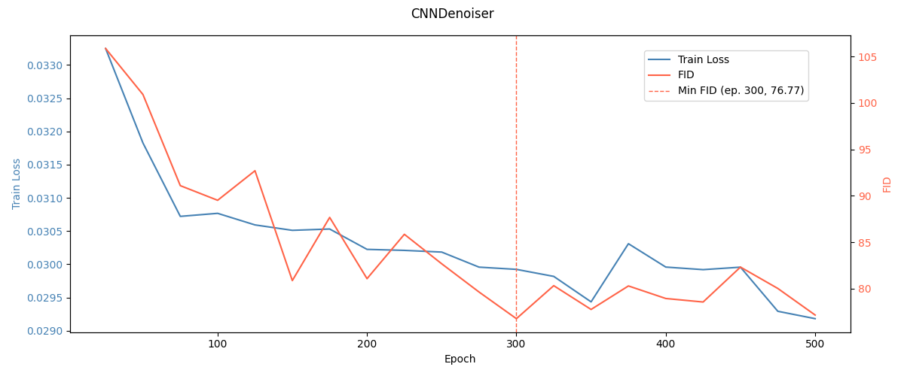
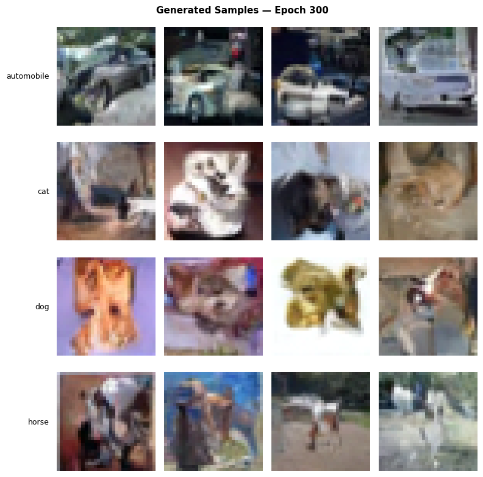
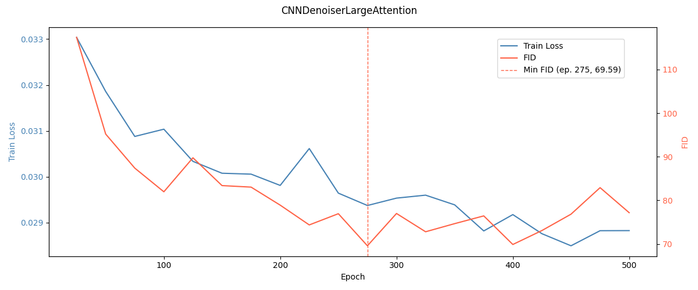
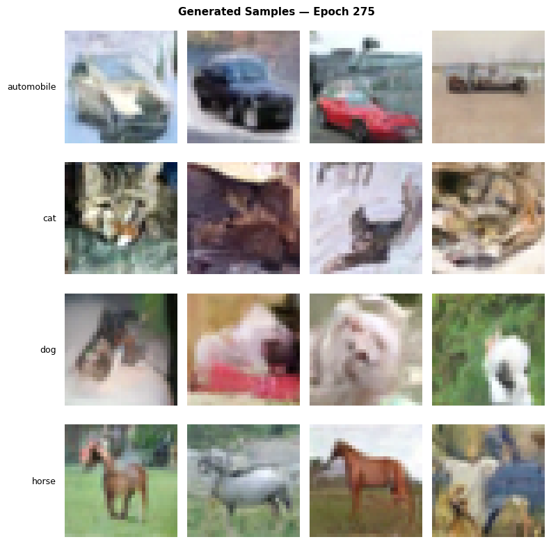
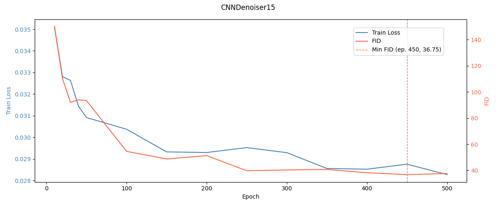

# Evolution of the CIFAR-10 Experiments

This file gives an overview about the results and evolution of architecture and training process
for handling the CIFAR-10 dataset in the task of image generation using U-Net style diffusion
models.

## General Architecture

To make it easy to switch out backbone models while keeping time and class conditioning,
the architecture was implemented such that backbone models implement the `BaseBackbone`
interface. This generalizes the idea, that every backbone's forward pass method
takes an input `x` as well as a conditional embedding `cond_emb` as an input. The
conditional embedding is here provided by the wrapper and therefore either realized
as a pure time conditional or as a time and class conditional embedding.

For the experiments described below, a time and class conditional embedding was used.

## 1. Small CNNDenoiser as a PoC

To test the general process, a small CNN-based U-Net was implemented.

### Architecture

**Time Embedding:** SinusoidalTimeEmbedding (128 embedding dimension)

**Backbone-Architecture:**

```text
Input
-> Init-Conv

-> Down1
-> Pool1

-> Down2
-> Pool2

-> Bottleneck

-> Up-sampling1
-> Up1 + Res

-> Up-sampling2
-> Up2 + Res

-> Out-Conv
```

➡️ Total number of parameters: 8M

**Backbone-Configuration:** 128 Base-Channels

**Training-Configuration:**

| Parameter     | Value |
|---------------|-------|
| Learning Rate | 1e-3  |
| Batch-Size    | 128   |

### Results

The FID- and Loss-Curve can be seen below.



We see, that the FID starts to level off after around 300 epochs and even though the loss further
decreases, the quality of the generated images based on the FID metric does not improve
anymore. This leads to the conclusion, that the model indeed learns, but is not capable
of depicting the CIFAR-10 dataset in a generation process well enough yet.

**Samples at the best FID score (epoch 300):**



The samples are not yet recognizable, besides some features in e.g. the class `automobile`.

## 2. CNNDenoiserLargeAttention

At this point, congrats to me for the amazing naming of this model 😉.
The *CNNDenoiserLargeAttention* implements a deeper model architecture, together with
introduced self-attention blocks at certain stages.

### Changed Architecture

```text
Input
-> Init-Conv

-> Down1
-> Pool1

-> Down2
-> Pool2

-> Down3
-> Pool3

-> Bottleneck
-> Attention

-> Up-sampling1
-> Up1 + Res
-> Attention

-> Up-sampling2
-> Up2 + Res

-> Up-sampling3
-> Up3 + Res

-> Out-Conv
```

➡️ Total number of parameters: 58M

### Results

The FID- and Loss-Curve can be seen below.



The FID score shows a lower minimum, indicating a better result in generating images based
on CIFAR-10. Still, we see a levelling off after again about 300 epochs at a not yet sufficient
quality. A little bit of research about the used models in the original DDPM paper shows, that
the backbone architecture seems to be too shallow. Deeper models will be applied in further
experiments.

**Samples at the best FID score (epoch 275):**



The samples are way more recognizable, compared to the result of the 8M model (CNNDenoiser)
above. A significantly better performance can be seen at `Automobile` and `Horse` compared
to the other classes. Still, the images lack realism.

For further experiments, even deeper models will be considered.

## 3. CNNDenoiser15

This model finally changes the naming, with the number `15` indicating the number of
convolutional blocks in the entire network. While increasing spatial processing, the
architecture in this experiment avoided further reducing spatial resolution, as the
bottleneck layers already process feature maps of only the size `4x4xC`.

### Architecture

```text
Input
-> Init-Conv

-> Down1a
-> Down1b
-> Pool1

-> Down2a
-> Down2b
-> Pool2

-> Down3a
-> Down3b
-> Pool3

-> Bottleneck
-> Attention
-> Bottleneck
-> Attention
-> Bottleneck

-> Up-sampling1
-> Up1b + Res
-> Attention
-> Up1a + Res

-> Up-sampling2
-> Up2b + Res
-> Attention
-> Up2a + Res

-> Up-sampling3
-> Up3b + Res
-> Up3a + Res

-> Out-Conv
```

This sums up to

```text
Encoder: 2 x 3 = 6 Conv Blocks
Bottleneck: 3 Conv Blocks
Decoder: 2 x 3 = 6 Conv Blocks

-> Total: 6 + 3 + 6 = 15 Conv Blocks
```

➡️ Total number of parameters: 167M

### Results

The curves of the FID and Training Loss can be seen below.



...

## 4. CNNDenoiser21

This model implements an even deeper architecture, using one more conv layer per
Down- and Up-Block.

### Architecture

```text
Input
-> Init-Conv

-> Down1a
-> Down1b
-> Down1c
-> Pool1

-> Down2a
-> Down2b
-> Down2c
-> Pool2

-> Down3a
-> Down3b
-> Down3c
-> Pool3

-> Bottleneck
-> Attention
-> Bottleneck
-> Attention
-> Bottleneck

-> Up-sampling1
-> Up1c + Res
-> Up1b + Res
-> Attention
-> Up1a + Res

-> Up-sampling2
-> Up2c + Res
-> Up2b + Res
-> Attention
-> Up2a + Res

-> Up-sampling3
-> Up3c + Res
-> Up3b + Res
-> Up3a + Res

-> Out-Conv
```

➡️ Total number of parameters: 230M

### New Residual Connections within Down-/Up-Blocks

Besides the additional layers at each sampling stage, this model also implements a SiLU
and a residual projection from the input to the final output layer within each Down- and
Up-Block.

### Results

...

## 5. CNNDenoiser27

Similar to the model before, this implementation also includes another convolutional block
per Down- and Up-Block.

### Architecture

```text
Input
-> Init-Conv

-> Down1a
-> Down1b
-> Down1c
-> Down1d
-> Pool1

-> Down2a
-> Down2b
-> Down2c
-> Down2d
-> Pool2

-> Down3a
-> Down3b
-> Down3c
-> Down3d
-> Pool3

-> Bottleneck
-> Attention
-> Bottleneck
-> Attention
-> Bottleneck

-> Up-sampling1
-> Up1d
-> Up1c
-> Up1b
-> Attention
-> Up1a

-> Up-sampling2
-> Up2d
-> Up2c
-> Up2b
-> Attention
-> Up2a

-> Up-sampling3
-> Up3d
-> Up3c
-> Up3b
-> Up3a

-> Out-Conv
```

➡️ Total number of parameters: 292M

### Results

...
