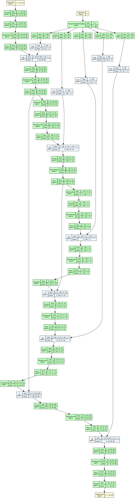
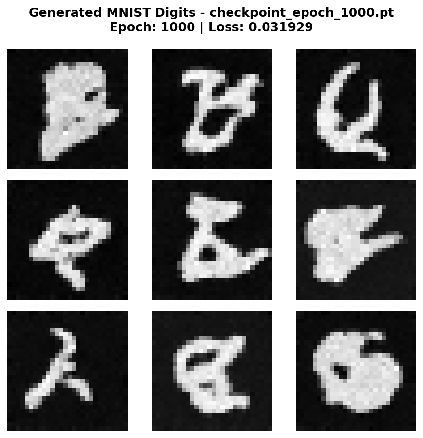
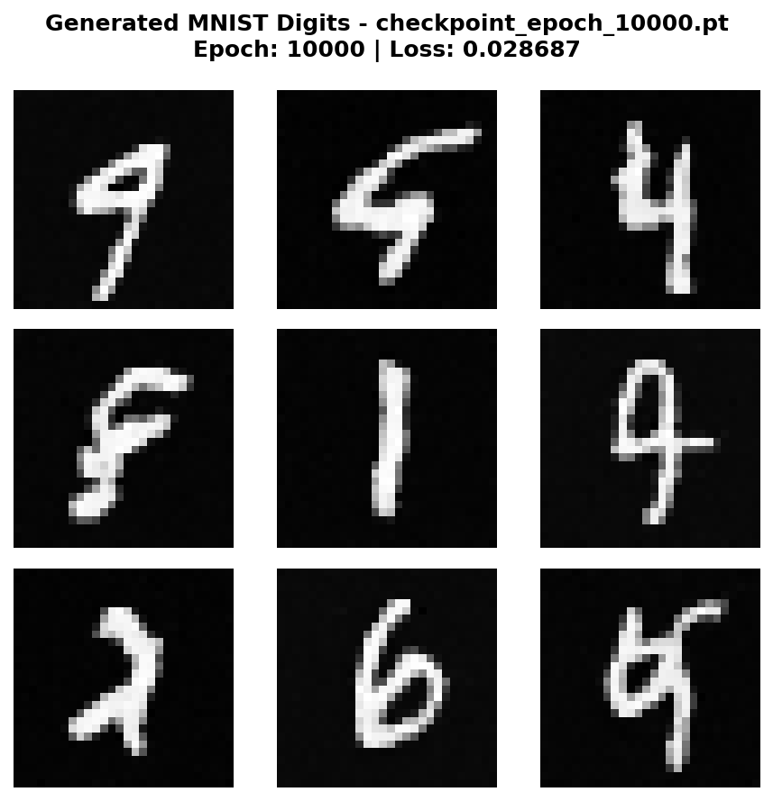
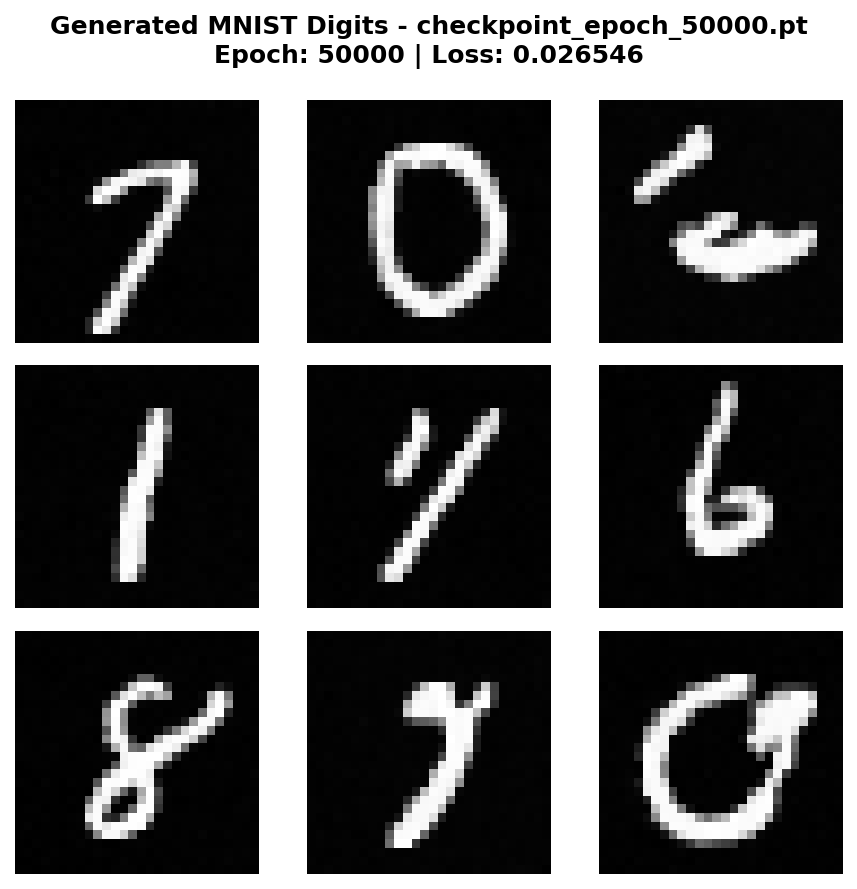

# MNIST Diffusion Model - Experiment Documentation

## Overview

This experiment implements a **Denoising Diffusion Probabilistic Model (DDPM)** trained on the MNIST dataset to generate
handwritten digits from pure noise. This represents a significant step up from toy 2D datasets, demonstrating that
diffusion models can generate realistic images.

## Architecture

### U-Net-style CNN Denoiser

We follow the idea of the **U-Net architecture** with the following details:



**Key Features:**

- **Convolutional layers** for classic feature extraction in image processing
- **Skip connections** help preserve fine details from encoder to decoder
- **Sinusoidal time embeddings** condition the network on the current diffusion time step
- **BatchNorm + ReLU** for more stable training

**Model Size:**

- Base channels: 32
- Time embedding dimension: 128
- Total parameters: 858,305

### Time Conditioning

The model uses **sinusoidal time embeddings** (similar to Transformers) to encode the current time step into a
high-dimensional vector. This time information is injected into each encoder and decoder block, allowing the network to
adapt its denoising strategy based on the noise level.

## Training Strategy

### Dataset

- **MNIST Training Set**: 60,000 grayscale images (28×28 pixels)
- **Normalization**: Scaled to [-1, 1] range

### Noise Schedule

- **Type**: Linear schedule
- **Time steps**: T = 1,000
- **Beta range**: [1e-4, 0.02]

The schedule controls how quickly noise is added during the forward process. A linear schedule means the noise increases
steadily over the 1,000 time steps.

### Training Configuration

- **Optimizer**: Adam
- **Learning rate**: 1e-3
- **Batch size**: 128
- **Loss function**: MSE (Mean Squared Error) between predicted and actual noise
- **Training epochs**: Up to 100,000 iterations

### Training Process

At each training step:

1. Sample a batch of real images from MNIST
2. Randomly sample time steps t for each image
3. Add noise according to the schedule at time t (forward diffusion)
4. Train the model to predict the added noise
5. Update weights via backpropagation

The model learns to denoise at ALL time steps simultaneously through random sampling.

## Generation Process

To generate new digits:

1. **Start**: Sample pure Gaussian noise $ x_T \sim N(0, I) $
2. **Iterate**: For t = T down to 1:
    - Predict noise using the trained model: $ \hat{\epsilon} = model(x_t, t) $
    - Compute the mean of $ p(x_{t-1} | x_t) $
    - **Add stochastic noise** (except at t=1) for diversity
    - Update: $ x_{t-1} = mean + \sigma_t \cdot noise $
3. **Output**: Final denoised image $ x_0 $

```text
Critical Discovery: Stochastic sampling (adding noise during generation) is essential for diversity! Without it, the
model generates the same "average" digit repeatedly.
```

## Results

### Training Progression

The model was trained for 100,000 epochs and saved checkpoints at regular intervals. Below are generated samples showing
how quality improves with training:

#### Epoch 1,000 (Early Training)



At 1,000 epochs, the model begins to learn basic digit structures. Shapes are recognizable but heavily
malformed.

#### Epoch 10,000 (Mid Training)



By 10,000 epochs, digits become clearer and more diverse. The model learns to distinguish between different digit
classes.

#### Epoch 50,000 (Advanced Training)



At 50,000 epochs, generated digits are looking way better. Diversity is given, with various styles
emerging. Note, that the digits are still only partially complete and sometimes malformed.

#### Epoch 79,000 (Best Model)


The best model (79,000 epochs) produces images similar to the result before, after 50,000 epochs. The digits are
mostly recognizable, with still clearly visible imperfections. The improvements of the model are
nevertheless clearly visible.

## Generic Training Pipeline

Note, that the same `train_denoiser()` function works for both:

- 2D toy datasets (Moons) with MLP
- Image datasets (MNIST) with CNN

The implemented abstraction of the process enables us to train models of different architecture
on different datasets. The adaption made from the 2-dimensional toy dataset to the
grayscale MNIST image dataset lies solely in the model architecture (MLP -> U-Net).

## Technical Implementation

### Key Components

1. **`CNNDenoiser`** (`src/diffusion_playground/models/cnn_denoiser.py`)
    - U-Net-style architecture
    - Sinusoidal time embeddings
    - Skip connections between encoder and decoder

2. **`LinearNoiseSchedule`** (`src/diffusion_playground/diffusion/noise_schedule.py`)
    - Computes $ \beta_t $, $ \alpha_t $, and $ \hat{\alpha}_t $ for each time step

3. **`train_denoiser()`** (`src/diffusion_playground/training/denoiser_trainer.py`)
    - Generic training loop
    - Automatic checkpointing
    - Works with any model that follows the interface

4. **`sample_xt()`** (`src/diffusion_playground/diffusion/training_utils.py`)
    - Adds noise during training

## Conclusion

This experiment successfully demonstrates that:

- ✅ Diffusion models can generate realistic MNIST digits
- ✅ U-Net architecture works well for image diffusion
- ✅ Stochastic sampling is crucial for diversity
- ✅ A generic training pipeline can handle multiple data types

---

**Experiment Date**: February 2026

**Training Hardware**: Google Colab T4 GPU

**Total Training Time**: ~2 hours

**Framework**: PyTorch 2.x
